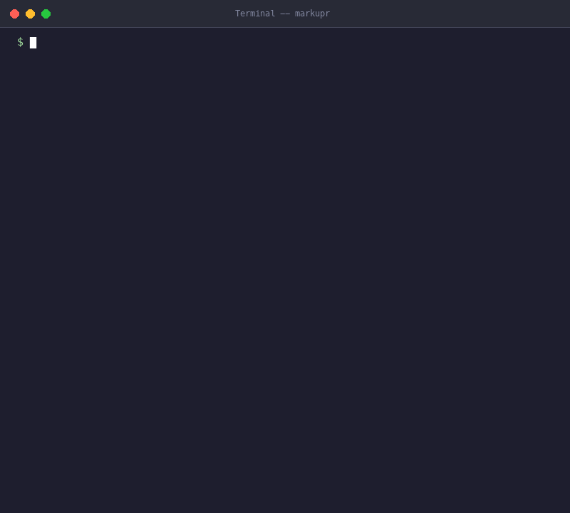

<p align="center">
  
</p>

<h1 align="center">markupR</h1>

<p align="center">
  <strong>Record your screen. Say what's wrong. Your AI agent fixes it.</strong>
</p>

<p align="center">
  <a href="https://www.npmjs.com/package/markupr"></a>
  <a href="https://www.npmjs.com/package/markupr"></a>
  <a href="https://github.com/eddiesanjuan/markupr/actions/workflows/ci.yml"></a>
  <a href="LICENSE"></a>
  <a href="https://github.com/eddiesanjuan/markupr/stargazers"></a>
</p>

<p align="center">
  <a href="#quick-start">Quick Start</a> &middot;
  <a href="#why-markupR">Why markupR</a> &middot;
  <a href="#mcp-server">MCP Server</a> &middot;
  <a href="#cli">CLI</a> &middot;
  <a href="#integrations">Integrations</a> &middot;
  <a href="#contributing">Contributing</a>
</p>

---

<p align="center">
  
</p>

## The Problem

AI coding agents can't see your screen. When you find a bug, you context-switch into writing mode -- describing the layout issue in text, manually screenshotting, cropping, and dragging images into the right spot. You speak at 150 words per minute but type at 60. The context is lost in translation.

## The Solution

markupR records your screen while you narrate what's wrong. When you stop, it runs an intelligent pipeline that correlates your transcript timestamps with the video to extract the right frames at the right moments -- then stitches everything into structured Markdown your AI agent can act on immediately.

- **Record** -- press a hotkey, talk through what you see
- **Process** -- Whisper transcribes, ffmpeg extracts frames at the exact moments you described
- **Output** -- structured Markdown with screenshots placed exactly where they belong

```
Cmd+Shift+F  -->  talk  -->  Cmd+Shift+F  -->  Cmd+V into your agent
```

## Quick Start

### CLI (zero install)

```bash
npx markupr analyze ./recording.mov
```

### MCP Server (for AI coding agents)

```bash
npx markupr-mcp
```

### Desktop App

Download from [markupr.com](https://markupr.com) or [GitHub Releases](https://github.com/eddiesanjuan/markupr/releases). Available for macOS and Windows.

No API keys required. Local Whisper transcription works out of the box.

## Why markupR?

**Local-first.** Whisper runs on your device. Your recordings, transcripts, and screenshots never leave your machine. No cloud dependency, no account required.

**AI-native output.** The Markdown output is structured for LLM consumption -- headings, categories, severity levels, and inline screenshots. Not a raw transcript with random images. Every screenshot shows exactly what you were describing when you said it.

**Works everywhere.** Desktop app for daily use. CLI for scripts and CI/CD. MCP server for agent integration. GitHub Action for PR feedback. Same pipeline, four interfaces.

**Open source.** MIT licensed. No telemetry, no tracking, no analytics. Read the source, fork it, ship it.

## What the Output Looks Like

```markdown
# Feedback Session -- Feb 5, 2026

## FB-001: Button sizing issue
The submit button is way too small on mobile. I'm trying to tap it
and keep hitting the cancel link underneath. Needs more vertical
padding, maybe 12px minimum tap target.


## FB-002: Loading state feels janky
After the spinner disappears, the content pops in with no transition.
There's a visible layout shift -- the sidebar jumps left by about
20 pixels.


```

Each screenshot is extracted from the exact video frame matching your narration timestamp. See full examples in [`examples/`](examples/).

## MCP Server

Give your AI coding agent eyes and ears. Add markupR as an MCP server and it can capture screenshots, record your screen with voice, and receive structured reports -- all mid-conversation.

### Setup

**Claude Code** (`~/.claude/settings.json`):

```json
{
  "mcpServers": {
    "markupR": {
      "command": "npx",
      "args": ["-y", "markupr-mcp"]
    }
  }
}
```

**Cursor / Windsurf** -- same config in your MCP settings.

### Tools

| Tool | Description |
|------|-------------|
| `capture_screenshot` | Grab the current screen. Your agent sees what you see. |
| `capture_with_voice` | Record screen + mic for a set duration. Returns a structured report. |
| `analyze_video` | Process any `.mov` or `.mp4` into Markdown with extracted frames. |
| `analyze_screenshot` | Run a screenshot through the AI analysis pipeline. |
| `start_recording` | Begin an interactive recording session. |
| `stop_recording` | End the session and run the full pipeline. |

### Example

```
You: "The sidebar is overlapping the main content on mobile. Can you see it?"

Agent: [calls capture_screenshot]
       "I can see the issue -- the sidebar has position: fixed but no z-index,
        and it's 280px wide with no responsive breakpoint. Let me fix the CSS..."

       [fixes the code]
```

No copy-pasting screenshots. No describing the bug in text. The agent looks at your screen and acts.

Full MCP documentation: [README-MCP.md](README-MCP.md)

## CLI

### Installation

```bash
# Run without installing
npx markupr analyze ./recording.mov

# Or install globally
npm install -g markupr
```

### Commands

**`markupR analyze <video>`** -- Process a screen recording into structured Markdown.

```bash
markupR analyze ./bug-demo.mov
markupR analyze ./recording.mov --output ./reports
markupR analyze ./recording.mov --template github-issue
markupR analyze ./recording.mov --no-frames  # transcript only
```

**`markupR watch [directory]`** -- Watch for new recordings and auto-process them.

```bash
markupR watch ~/Desktop --output ./reports
```

**`markupR push github <report>`** -- Create GitHub issues from a feedback report.

```bash
markupR push github ./report.md --repo myorg/myapp
markupR push github ./report.md --repo myorg/myapp --dry-run
```

**`markupR push linear <report>`** -- Create Linear issues from a feedback report.

```bash
markupR push linear ./report.md --team ENG
```

### Output Templates

`markdown` (default) | `json` | `github-issue` | `linear` | `jira` | `html`

### Requirements

- Node.js 18+
- [ffmpeg](https://ffmpeg.org/) on your PATH (`brew install ffmpeg` / `apt install ffmpeg` / `choco install ffmpeg`)

## Integrations

### GitHub Action

Run markupR in CI to get visual feedback on pull requests:

```yaml
- uses: eddiesanjuan/markupr-action@v1
  with:
    video-path: ./recordings/
    github-token: ${{ secrets.GITHUB_TOKEN }}
```

### Desktop App Workflow

1. Press `Cmd+Shift+F` (macOS) or `Ctrl+Shift+F` (Windows)
2. Narrate what you see -- screenshots capture automatically during pauses
3. Press the hotkey again to stop
4. Paste the file path from your clipboard into Claude Code, Cursor, or any AI agent

## How It Works

```
                    +-----------+
  Screen + Voice -> | Whisper   | -> Timestamped transcript
                    +-----------+
                         |
                    +-----------+
                    | Analyzer  | -> Key moments identified
                    +-----------+
                         |
                    +-----------+
                    | ffmpeg    | -> Frames extracted at exact timestamps
                    +-----------+
                         |
                    +-----------+
                    | Generator | -> Structured Markdown with inline screenshots
                    +-----------+
```

The pipeline degrades gracefully. No ffmpeg? Transcript-only output. No Whisper model? Timer-based screenshots. No API keys? Everything runs locally.

For architecture details, see [CLAUDE.md](CLAUDE.md).

## Development

```bash
git clone https://github.com/eddiesanjuan/markupr.git
cd markupR
npm install
npm run dev
```

| Command | Description |
|---------|-------------|
| `npm run dev` | Development mode with hot reload |
| `npm run build` | Build everything (desktop + CLI + MCP) |
| `npm test` | Run all tests |
| `npm run lint` | Lint |
| `npm run typecheck` | Type check |

## Contributing

1. Fork the repository
2. Create a feature branch: `git checkout -b feature/your-feature`
3. Run tests: `npm test && npm run lint && npm run typecheck`
4. Open a Pull Request

See [CONTRIBUTING.md](CONTRIBUTING.md) for full guidelines.

## License

MIT -- see [LICENSE](LICENSE).

---

<p align="center">
  Built by <a href="https://github.com/eddiesanjuan">Eddie San Juan</a><br>
  <a href="https://markupr.com">markupr.com</a>
</p>
