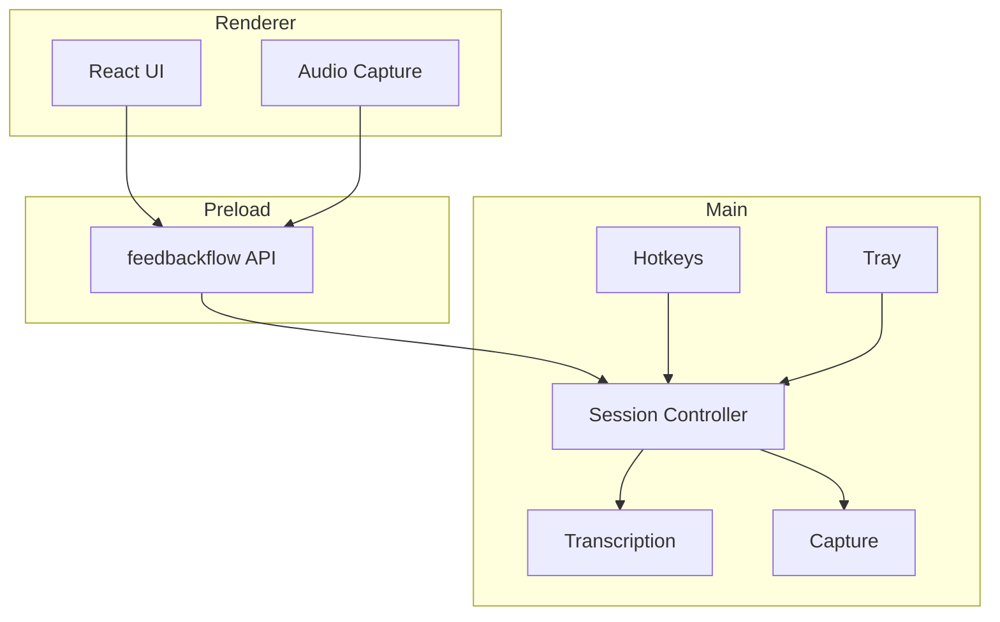
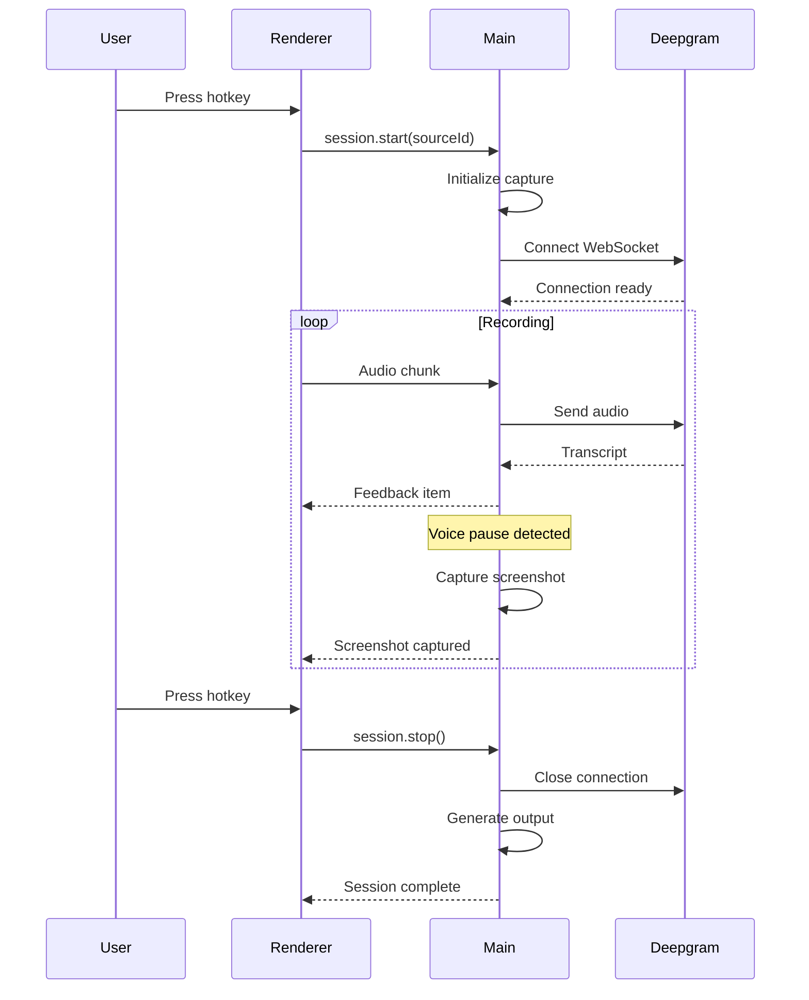
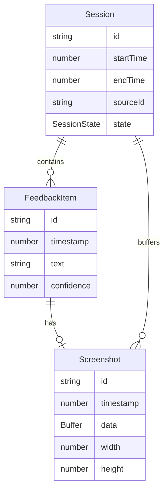

# Architecture

This document provides a high-level overview of FeedbackFlow's architecture.

## Table of Contents

- [Overview](#overview)
- [Process Model](#process-model)
- [State Management](#state-management)
- [Data Flow](#data-flow)
- [Service Architecture](#service-architecture)
- [Security Model](#security-model)

## Overview

FeedbackFlow is an Electron application with a React frontend. It follows Electron's multi-process architecture with clear separation between the main process (Node.js) and renderer process (Chromium).

```
┌─────────────────────────────────────────────────────────────────┐
│                        FeedbackFlow                              │
├─────────────────────────────────────────────────────────────────┤
│                                                                  │
│  ┌──────────────────┐                ┌──────────────────────┐   │
│  │   Main Process   │◄──── IPC ─────►│  Renderer Process    │   │
│  │    (Node.js)     │                │    (Chromium)        │   │
│  │                  │                │                      │   │
│  │  - Capture       │                │  - React UI          │   │
│  │  - Transcription │                │  - Audio Capture     │   │
│  │  - File I/O      │                │  - Visualization     │   │
│  │  - Settings      │                │                      │   │
│  │  - Hotkeys       │                │                      │   │
│  └──────────────────┘                └──────────────────────┘   │
│                                                                  │
└─────────────────────────────────────────────────────────────────┘
```

## Process Model

### Main Process

The main process handles:

- **System Integration**: Tray icons, hotkeys, native menus
- **Screen Capture**: Using Electron's desktopCapturer
- **File Operations**: Saving sessions, screenshots
- **Settings**: Persistent storage via electron-store
- **Secure Storage**: API keys via keytar
- **Updates**: Auto-updater
- **Session Orchestration**: State machine, service coordination

### Renderer Process

The renderer process handles:

- **User Interface**: React components
- **Audio Capture**: Web Audio API (requires renderer for MediaDevices)
- **Visualization**: Waveforms, transcription preview
- **User Input**: Buttons, forms, drag operations

### Preload Script

The preload script bridges the two processes:

- **Context Isolation**: Enabled for security
- **Node Integration**: Disabled in renderer
- **API Exposure**: via `contextBridge.exposeInMainWorld`

```typescript
// Preload exposes a safe API
contextBridge.exposeInMainWorld('feedbackflow', {
  session: {
    start: (sourceId) => ipcRenderer.invoke('feedbackflow:session:start', sourceId),
    // ...
  },
  // ...
});
```

## State Management

### Session State Machine

The session follows a finite state machine pattern:

```
                    ┌───────────────────────────────────────┐
                    │                                       │
                    ▼                                       │
┌──────┐  start  ┌───────────┐  stop   ┌────────────┐     │
│ idle │────────►│ recording │───────►│ processing │─────┘
└──────┘         └───────────┘         └────────────┘
   ▲                  │                      │
   │                  │ cancel               │ complete
   │                  │                      │
   │                  ▼                      ▼
   │              ┌──────┐             ┌──────────┐
   └──────────────│ idle │◄────────────│ complete │
                  └──────┘             └──────────┘
```

**States**:
- `idle`: No active session
- `recording`: Capturing audio and screenshots
- `processing`: Generating output
- `complete`: Session saved

### State in Main Process

```typescript
// SessionController manages state
class SessionController {
  private state: SessionState = 'idle';
  private session: Session | null = null;

  async start(sourceId: string): Promise<void> {
    if (this.state !== 'idle') throw new Error('Invalid state');
    this.state = 'recording';
    // ...
  }
}
```

### State in Renderer

React components subscribe to state changes:

```tsx
function App() {
  const [state, setState] = useState<SessionState>('idle');

  useEffect(() => {
    const unsubscribe = window.feedbackflow.session.onStateChange(({ state }) => {
      setState(state);
    });
    return unsubscribe;
  }, []);
}
```

## Data Flow

### Recording Flow

```
┌─────────────────────────────────────────────────────────────────┐
│                        Recording Flow                            │
└─────────────────────────────────────────────────────────────────┘

User speaks
    │
    ▼
┌──────────────────┐
│  AudioCapture    │  (Renderer - Web Audio API)
│  (Renderer)      │
└────────┬─────────┘
         │ Audio chunks (100ms)
         ▼
┌──────────────────┐
│  Main Process    │  IPC: AUDIO_CHUNK
│                  │
└────────┬─────────┘
         │
         ├────────────────────────┐
         │                        │
         ▼                        ▼
┌──────────────────┐    ┌──────────────────┐
│ Transcription    │    │ Intelligent      │
│ Service          │    │ Capture          │
│ (Deepgram WS)    │    │                  │
└────────┬─────────┘    └────────┬─────────┘
         │                        │
         │ Transcript             │ Voice pause detected
         │                        │
         ▼                        ▼
┌──────────────────┐    ┌──────────────────┐
│ Session          │    │ Screen           │
│ Controller       │◄───│ Capture          │
│                  │    │                  │
└────────┬─────────┘    └──────────────────┘
         │
         │ Feedback item
         │
         ▼
┌──────────────────┐
│  Renderer        │  IPC: SESSION_FEEDBACK_ITEM
│  (UI Update)     │
└──────────────────┘
```

### Export Flow

```
User clicks Export
    │
    ▼
┌──────────────────┐
│  ExportDialog    │  User selects format
│  (Renderer)      │
└────────┬─────────┘
         │
         ▼
┌──────────────────┐
│  Main Process    │  IPC: OUTPUT_EXPORT
│                  │
└────────┬─────────┘
         │
         ▼
┌──────────────────┐
│  ExportService   │  Generates document
│                  │
└────────┬─────────┘
         │
         ├───────────────────────────────┐
         │                               │
         ▼                               ▼
┌──────────────────┐           ┌──────────────────┐
│ Markdown         │           │ PDF / HTML       │
│ Generator        │           │ Generator        │
└────────┬─────────┘           └────────┬─────────┘
         │                               │
         └───────────────┬───────────────┘
                         │
                         ▼
                ┌──────────────────┐
                │  FileManager     │  Saves to disk
                └──────────────────┘
```

## Service Architecture

### Main Process Services

```
┌─────────────────────────────────────────────────────────────────┐
│                     Main Process Services                        │
├─────────────────────────────────────────────────────────────────┤
│                                                                  │
│  ┌─────────────────────────────────────────────────────────┐   │
│  │                  SessionController                       │   │
│  │  - State machine                                         │   │
│  │  - Service coordination                                  │   │
│  │  - Event emission                                        │   │
│  └─────────────────────────────────────────────────────────┘   │
│         │                │                │                     │
│         │                │                │                     │
│         ▼                ▼                ▼                     │
│  ┌───────────┐    ┌───────────┐    ┌───────────┐              │
│  │ Capture   │    │Transcript │    │  Output   │              │
│  │ Service   │    │ Service   │    │ Service   │              │
│  └───────────┘    └───────────┘    └───────────┘              │
│                                                                  │
│  ┌───────────┐    ┌───────────┐    ┌───────────┐              │
│  │  Hotkey   │    │   Tray    │    │ Settings  │              │
│  │  Manager  │    │  Manager  │    │  Manager  │              │
│  └───────────┘    └───────────┘    └───────────┘              │
│                                                                  │
│  ┌───────────┐    ┌───────────┐    ┌───────────┐              │
│  │   Menu    │    │  Crash    │    │   Auto    │              │
│  │  Manager  │    │ Recovery  │    │  Updater  │              │
│  └───────────┘    └───────────┘    └───────────┘              │
│                                                                  │
└─────────────────────────────────────────────────────────────────┘
```

### Service Descriptions

| Service | Responsibility |
|---------|----------------|
| **SessionController** | Orchestrates recording sessions, manages state |
| **CaptureService** | Screen capture via desktopCapturer |
| **IntelligentCapture** | Voice-triggered screenshot timing |
| **TranscriptionService** | Deepgram WebSocket integration |
| **OutputService** | Document generation coordination |
| **HotkeyManager** | Global hotkey registration |
| **TrayManager** | System tray icon and menu |
| **MenuManager** | Native application menu |
| **SettingsManager** | Persistent settings via electron-store |
| **CrashRecovery** | Session recovery after crashes |
| **AutoUpdater** | Application updates |

### Service Communication

Services communicate through:

1. **Direct method calls** (same process)
2. **Events** (pub/sub pattern)
3. **IPC** (between processes)

```typescript
// SessionController coordinates services
class SessionController {
  constructor(
    private capture: CaptureService,
    private transcription: TranscriptionService,
    private output: OutputService,
  ) {}

  async start(sourceId: string) {
    // Direct method calls
    await this.capture.start(sourceId);
    await this.transcription.connect();

    // Event subscription
    this.transcription.on('transcript', (text) => {
      this.handleTranscript(text);
    });
  }
}
```

## Security Model

### Context Isolation

The renderer process is sandboxed:

```typescript
// main/index.ts
new BrowserWindow({
  webPreferences: {
    contextIsolation: true,   // Enabled
    nodeIntegration: false,   // Disabled
    preload: 'preload.js',    // Bridge
  },
});
```

### Secure API Key Storage

API keys are stored using system keychain:

```typescript
// macOS: Keychain
// Windows: Credential Manager
// Linux: Secret Service

import keytar from 'keytar';

await keytar.setPassword('feedbackflow', 'deepgram', apiKey);
const key = await keytar.getPassword('feedbackflow', 'deepgram');
```

### Content Security Policy

```html
<meta http-equiv="Content-Security-Policy"
      content="default-src 'self'; script-src 'self'; style-src 'self' 'unsafe-inline'">
```

### IPC Security

All IPC channels are:
- Explicitly defined in shared types
- Validated in handlers
- Never expose raw Node.js APIs

```typescript
// Safe: Defined channel with specific handler
ipcMain.handle('feedbackflow:session:start', async (_, sourceId: string) => {
  // Validate input
  if (typeof sourceId !== 'string') throw new Error('Invalid sourceId');
  return sessionController.start(sourceId);
});

// Unsafe (never do this): Exposing arbitrary execution
ipcMain.handle('execute', (_, code) => eval(code)); // NEVER!
```

## Diagrams

### Component Interaction



### Recording Sequence



### Data Model


